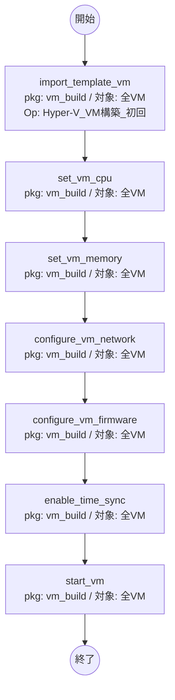

# Conductor A「仮想マシン構築」フロー（ロールパッケージ: vm_build）

実行対象: Hyper-Vホスト（WinRM）。各Movementは `loop: VAR_vm` で全VMを処理。
失敗時方針: **即時中断**。HW設定は**逐次**。

## 設計根拠
- HW構成（CPU/メモリ/NW/ファームウェア）はVM**停止中**に行うため `start_vm` より前。
- 時刻同期（統合サービス）も起動前に有効化。
- 全7ロールはロールパッケージ **vm_build** に同梱。
