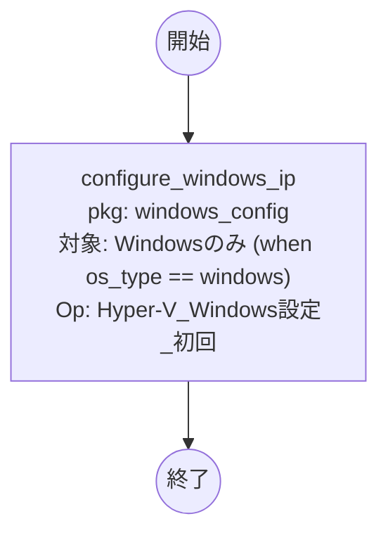

# Conductor B「Windows設定変更」フロー（ロールパッケージ: windows_config）

VM起動後、Windowsゲストの静的IPを PowerShell Direct で投入。
実行対象は Hyper-Vホスト（WinRM）。`when: os_type == 'windows'` でWindowsのみ処理。

## 設計根拠
- IP投入は**VM起動後**（Conductor A 完了後）に実施するため分離。
- 将来のWindows OS設定値（ホスト名・ドメイン参加等）は本Conductor/パッケージに追記。
