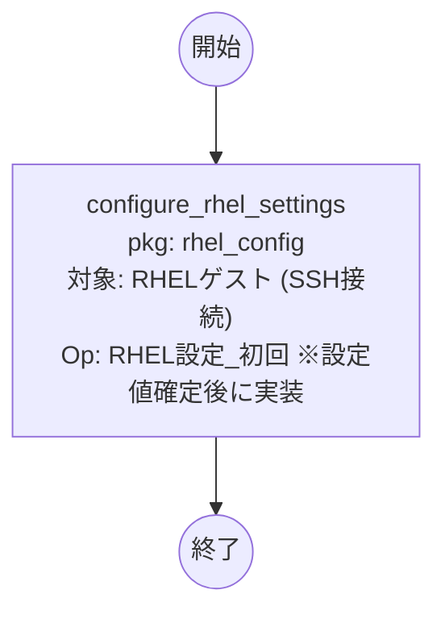

# Conductor C「RHEL設定変更」フロー（ロールパッケージ: rhel_config）

RHELゲストのOS設定変更。**実行対象は RHELゲストVM そのもの（SSH接続 / WinRM:False）**。
RHELはkickstartで静的IP割当済みのためAnsibleから直接到達できる。

> 現時点でRHEL固有の設定値は未確定（IP=kickstart済 / 時刻同期=vm_buildで実施済）。
> 本Conductor/ロールは**スケルトン**。設定内容が確定したら configure_rhel_settings に冪等タスクを実装する。

## 設計根拠
- RHEL設定はゲスト到達後に実施。Windowsと接続方式（SSH vs WinRM/PowerShell Direct）が異なるため、
  ロールパッケージ・Conductorを分離。
